# A DATING APP WITHOUT PHOTOS &#x1F48F; &#x1F46C; &#x1F46D;
## *The advantage of this app is that it doesn't have a photo can mislead your mind, and you can decide whether to make friends by the way you talk to each other. In the other words, it's the soul that counts.*
## Instruction
  When it starts, we can choose our identity, a user or an administrator.

  Button can operate by  "WASD"  or  "↑ ↓ ← →"

### `Administrator`
  ✨ If I am an administrator, just enter my password then I can do everything to the database.

  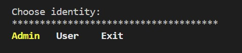
   
   
  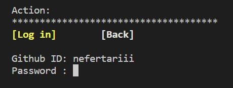
   
   
   
  ✨ There are five operations the administrator can use. All of these results will be printed at `output.txt`.

  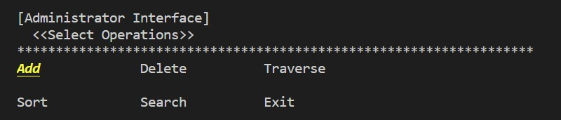

  ## Add : fill in the person's basic information and press "Yes", the data will be added in database.
  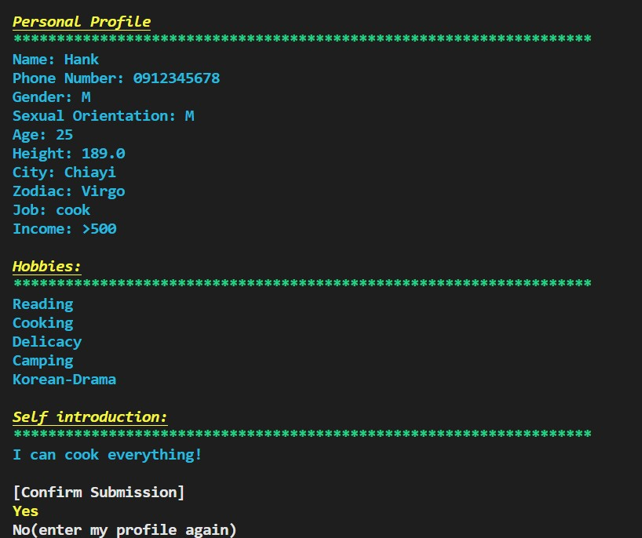
   
   
  
   
   

  ## Search : Use phone number to find the person information.
  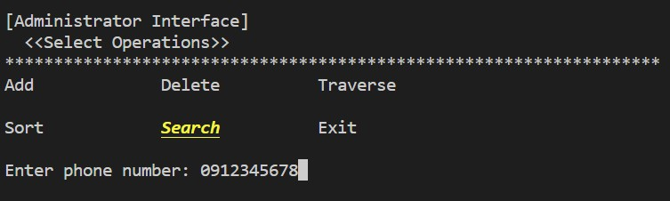
   
   
  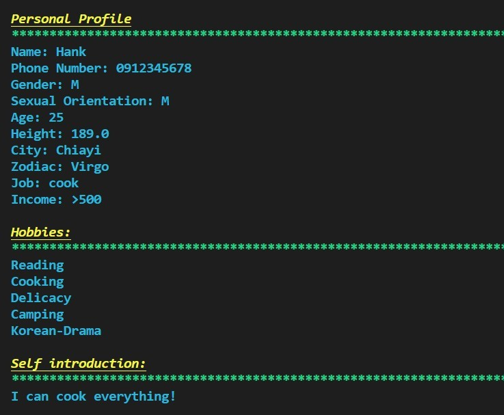
   
   
  
  ## Delete : Use phone number to find the person, and he/she will be deleted.
  
  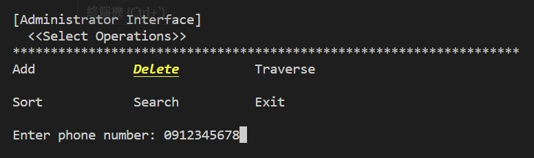
   
   
  
   
   

  ## Traverse : Display every data on the screen, press "Next" or "Prior" to see another data.

  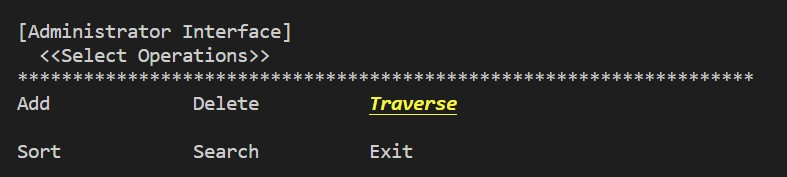
   
   
  
   
   

  ## Sort : Use different condition to sort data and change order in the data base. There are eight kinds of condition, like `Gender`, `Phone`, `Area`, `Target`, `Height`, ` Zodiac`, `Age`, `Income`.                
                                
  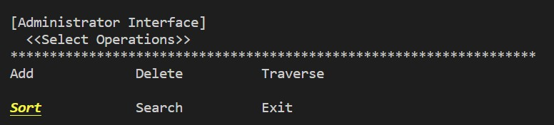
   
   
  
   
   
  
   
   
  
### `User`

  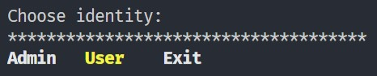
   
   
  ✨ If you are a user, as a normal dating app, You can Sign in to the original account

  After successfully signed in, you can skip directly to the `Choose Preference`
   
   
  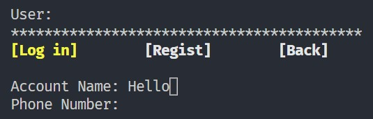
   

  ✨ Or I should enter my phone number to register. 

  (Remember that the same phone number can't be registered again)
   
   
  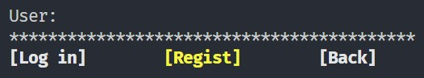
   

  After you press the regist button, enter your age honestly 🔞, it will check whether you can register or not.

  ✨ If you are allowed to continue, enter your personal information, like name, gender, sex orientation , height, job and so on. If everything is done, you can check whether it's correct. You can revise it by pressing "No". Then, press "Yes" to continue.

  

  ## Choose  Preference

  ✨ In this part, you can choose which kind of characteristic is your preference. Press `Zodiac`, `Height`, or `Age` to set. The person whose height or age isn't within your preferred range won't appear. In the other words, we ensure that every person displayed on the screen may be your type. 😉Likewise, press `Next` to continue.

  
   
   
  
   
   
  
   
   
  

  ## Start to find your soulmate!

  
   
   

  ✨ Interested in 20 people is the upper limit. If you don't like anyone but the display has ended, the following message will pop up. It will ask you if you want to re-enter your preference. Press "Yes", the program will go to the part which ask you to choose your preference. Otherwise, you can press "No" and get some special messages.

   
   
   
   
   
   
  
  ✨ If you like less than 20 people but the display is over, the program will directly send these people to a delete list. You can check whether these people on the list are your chioces, if some of them aren't, you can delete up to three people and send it out, or directly send out your final decision (these people) and see if there are someone also interested in you.

  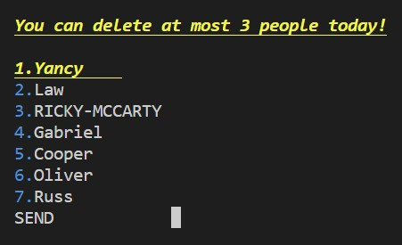
   
   

  ✨ Delete *Cooper* you've chosen.

  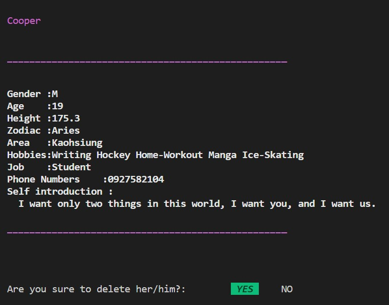
   
   
  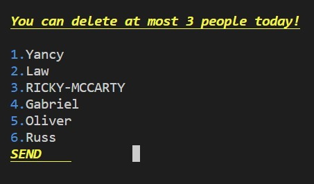
   
   

  ✨ If you see the list below appear, it means that you've chosen 20 people. You also need to check whether they are your final choices, then make decision and send it out as we mentioned above.

  
   
   

  ✨ You may be lucky(or not), in these 20 people, there are some of them also like you! Now you get important detailed information! Afrer getting their `income`, you can consider whether you two are compatible or not. The most important information is their `phone number`! It means that you can contact with each other in real life, and know if you can get along well.

  ✨ After you finish matching, if there is no `SOULMATE` in your choice, you can get back to pairing mode to choose a new match. On the contrary, you can end the program and manage your love.💛
   
   
  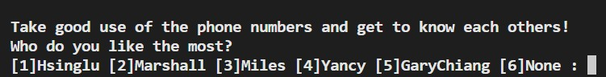

  ✨ If you've chosen a person you like the most, the program will terminate.

  ✨ Otherwise, you can choose None and exit program or wait a day and re-select 20 people you like.

  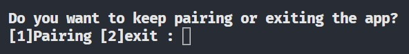
   

  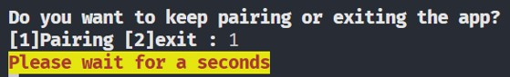
   

  
   

  ***`And go back to Start to find your soulmate!`***