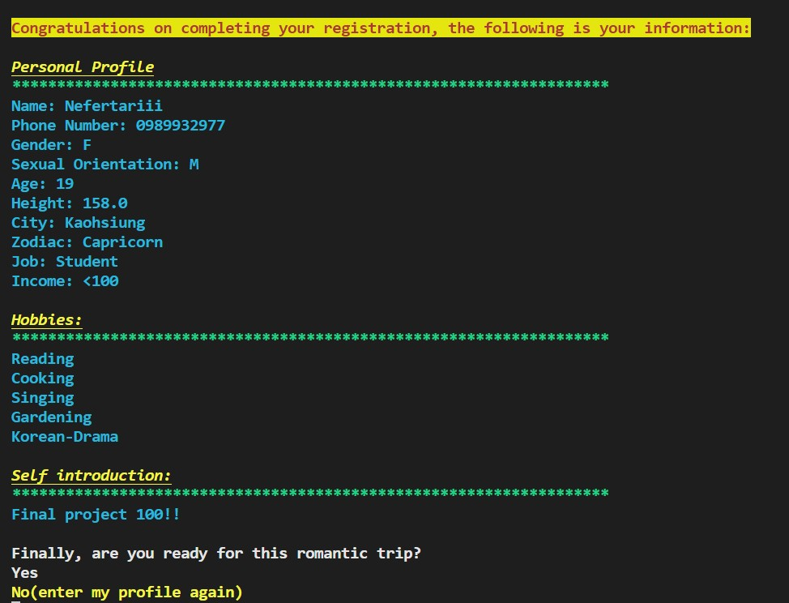
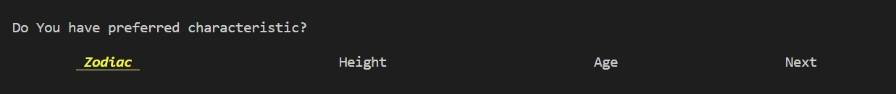
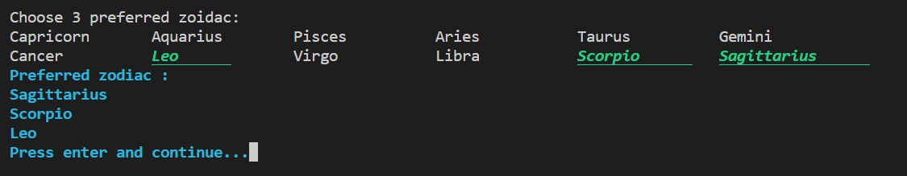
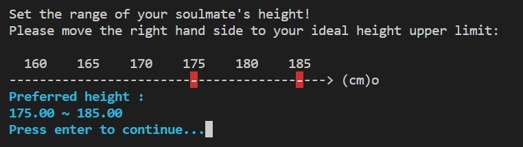
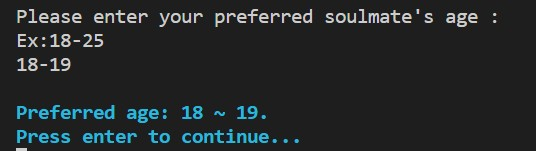
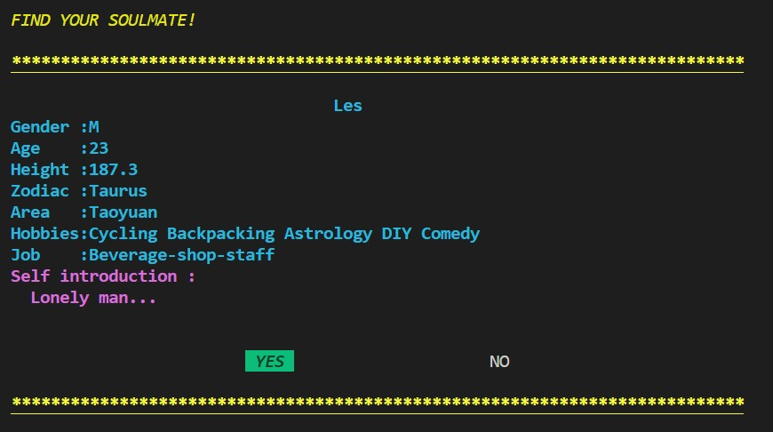

# A DATING APP WITHOUT PHOTOS &#x1F48F; &#x1F46C; &#x1F46D;
## *The advantage of this app is that it doesn't have a photo can mislead your mind, and you can decide whether to make friends by the way you talk to each other. In the other words, it's the soul that counts.*
## Instruction
  When it starts, we can choose our identity, a user or an administrator.

### `Administrator`
  ✨ If I am an administrator, just enter my password then I can do everything to the database.

### `User`

  ✨ If I am a user, as a normal dating app, I should enter my phone number to register. 
  (Remember that the same phone number can't be registered again)

  Next, enter your age honestly 🔞, it will check whether you can register or not.

  ✨ If you are allowed to continue, enter your personal information, like name, gender, sex orientation , height, job and so on. If everything is done, you can check whether it's correct. You can revise it by pressing "No". Then, press "Yes" to continue.

  

  ✨ In this part, you can choose which kind of characteristic is your preference. Press `Zodiac`, `Height`, or `Age` to set. The person whose height or age isn't within your preferred range won't appear. In the other words, we ensure that every person displayed on the screen may be your type. 😉Likewise, press `Next` to continue.

  
  
  
  

  ✨ Start to find your soulmate!
  
  
  ✨ Interested in 20 people is the upper limit. If you see the messages below appear, you must make decision. To delete up to three people and continue the pairing mode, or directly send out your final decision (these 20 people) and see if there are someone also interested in me.
  
  ✨ Delete someone you've chosen.
  
  ✨ You may be lucky(or not), in these 20 people, there are some of them also like you! Now you get important detailed information! Afrer getting their `income`, you can consider whether you two are compatible or not. The most important information is their `phone number`! It means that you can contact with each other in real life, and know if you can get along well.

  ✨ After you finish matching, if there is no `SOULMATE` in your choice, you can get back to pairing mode to choose a new match. On the contrary, you can end the program and manage your love.💛

 

